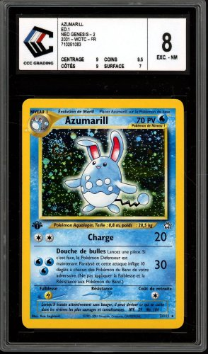
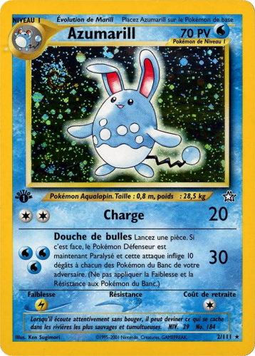

# Extracteur de cartes Pokémon gradées

Ce programme prend des photos/scans de cartes Pokémon gradées (dans leur
coque PSA, PCA, ...) et en extrait **uniquement la carte** : il détecte
ses contours, redresse la perspective, recadre au format officiel d'une
carte (ratio 63×88 mm) et enregistre le résultat en **PNG sans perte de
qualité** dans un dossier de sortie.

- **Entrée** : le dossier `input`, avec vos images (`.webp`, `.png`,
  `.jpg`, `.jpeg`, `.bmp`, `.tif`)
- **Sortie** : le dossier `output`, avec un fichier `<nom>_carte.png`
  par image (coins arrondis transparents, comme la vraie carte)

Aucune connaissance en informatique n'est requise : ce document vous guide
pas à pas, depuis le téléchargement du projet jusqu'à l'obtention de vos
premières cartes extraites.

## Aperçu

| Avant (scan de la carte gradée) | Après (carte extraite) |
|:---:|:---:|
|  |  |

---

## 1. Télécharger le projet

Si vous lisez ce fichier directement sur GitHub, commencez par récupérer
le projet sur votre ordinateur.

### Option A — sans rien installer (le plus simple)

1. Sur la page GitHub du projet, cliquez sur le bouton vert **« Code »**.
2. Cliquez sur **« Download ZIP »**.
3. Une fois le fichier `.zip` téléchargé, **faites un clic droit dessus**
   puis **« Extraire tout... »** (Windows) ou double-cliquez dessus
   (macOS). Choisissez un dossier facile à retrouver, par exemple votre
   Bureau.
4. Vous obtenez un dossier contenant `extract_cards.py`, `README.md`,
   etc. C'est ce dossier que vous utiliserez à la partie « 3. Utilisation »
   ci-dessous.

### Option B — avec Git (si vous savez déjà vous en servir)

```bash
git clone https://github.com/floSa/Images-collection-clean.git
cd Images-collection-clean
```

---

## 2. Installation (à faire une seule fois)

Le programme utilise **uv**, un outil qui installe tout seul Python et
les bibliothèques nécessaires. Vous n'avez **pas besoin d'installer
Python vous-même**.

### Windows

1. Ouvrez le menu Démarrer, tapez `PowerShell` et ouvrez-le.
2. Copiez-collez cette commande puis appuyez sur Entrée :

   ```powershell
   powershell -ExecutionPolicy ByPass -c "irm https://astral.sh/uv/install.ps1 | iex"
   ```

3. **Fermez puis rouvrez** PowerShell (important, sinon la commande
   `uv` ne sera pas reconnue).
4. Vérifiez que ça a marché en tapant :

   ```powershell
   uv --version
   ```

   Si un numéro de version s'affiche, c'est bon !

### macOS / Linux

1. Ouvrez le Terminal.
2. Copiez-collez cette commande puis appuyez sur Entrée :

   ```bash
   curl -LsSf https://astral.sh/uv/install.sh | sh
   ```

3. Fermez puis rouvrez le Terminal, et vérifiez avec `uv --version`.

---

## 3. Utilisation

### Étape 1 — Ouvrir un terminal dans le dossier du programme

Le dossier du programme est celui qui contient `extract_cards.py`.

- **Windows** : ouvrez ce dossier dans l'Explorateur de fichiers, faites
  un clic droit dans le vide et choisissez **« Ouvrir dans le
  Terminal »**. (Ou tapez `cmd` dans la barre d'adresse de l'Explorateur
  puis Entrée.)
- **macOS** : clic droit sur le dossier → **Services** → **Nouveau
  terminal au dossier**.

### Étape 2 — Mettre vos images dans `input`

Placez vos scans/photos de cartes gradées dans le dossier `input` (créez-le
à côté de `extract_cards.py` s'il n'existe pas — le programme le crée
aussi tout seul au premier lancement).

### Étape 3 — Lancer le programme

```bash
uv run python extract_cards.py
```

> La **première fois**, uv télécharge Python et les bibliothèques :
> c'est normal que ça prenne une à deux minutes. Les fois suivantes,
> c'est instantané.

Le programme affiche une ligne par image traitée :

```
5 image(s) à traiter -> C:\...\output
  [OK] 001_NeoG.webp -> 001_NeoG_carte.png (1005x1404)
  ...
Terminé sans erreur.
```

Les cartes extraites sont dans le dossier `output`, créé automatiquement.

### Remarques

- Pour utiliser d'autres dossiers que `input`/`output` :
  `uv run python extract_cards.py --src "C:\Mes Scans" --out "C:\Mes Cartes"`
  (guillemets nécessaires si le chemin contient des espaces).
- Vous pouvez relancer le programme sans risque : les images déjà
  traitées sont simplement régénérées.

---

## 4. En cas de problème

| Symptôme | Solution |
|---|---|
| `uv : terme non reconnu` / `command not found` | Fermez et rouvrez le terminal après l'installation de uv. |
| `Aucune image trouvée dans ...` | Vérifiez que vos images sont bien dans le dossier `input` et au format `.webp`, `.png`, `.jpg`, `.jpeg`, `.bmp` ou `.tif`. |
| `[ECHEC] Carte non détectée : ...` | La photo est probablement trop sombre, floue ou la carte est coupée. Reprenez une photo bien cadrée, de face, sur fond contrasté. |
| La carte extraite garde un bord de coque | Relancez avec `uv run python extract_cards.py --debug` : les images dans `output/debug/` montrent le contour détecté en rouge, pratique pour comprendre ce qui se passe. |

---

## 5. Comment ça marche (pour les curieux)

1. **Détection** : le programme cherche des quadrilatères ayant les
   proportions d'une carte, via plusieurs analyses combinées (contours,
   saturation des couleurs — la carte est colorée alors que la coque est
   grise —, luminosité).
2. **Raffinement** : si une marge de coque subsiste autour de la carte,
   le cadrage est resserré par passes successives, puis chaque bord est
   calé au pixel près sur la frontière carte/coque, repérée par la
   montée de chroma (le plastique de la coque est gris/noir, le bord
   imprimé de la carte est coloré). Chaque bord est mesuré en 6 points
   et la ligne de coupe passe à l'intérieur de toutes les mesures, pour
   qu'une carte légèrement bombée dans sa coque ne laisse aucun biseau.
3. **Export** : la perspective est corrigée en une seule transformation
   depuis l'image d'origine (aucune perte cumulée), au ratio exact
   63:88, puis enregistrée en PNG (format sans perte). La résolution de
   la photo d'origine est conservée telle quelle, et les coins sont
   rendus transparents suivant l'arrondi officiel de la carte (3 mm).
